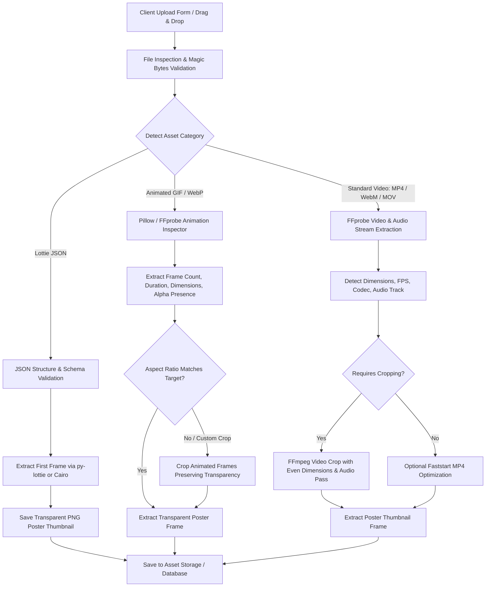

# Video & Animation Assets Upload Pipeline

Modern applications handle a wide variety of dynamic media beyond basic MP4 videos, including animated GIFs, WebP animations, Apple QuickTime with alpha, and Lottie vector animations.

This reference provides an exhaustive taxonomy, validation checklist, and architectural upload pipeline to handle **all types of video and animation assets**.

---

## 1. Taxonomy of Video & Animation Assets

| Asset Type | File Extensions | MIME Type | Key Features | Transparency? | Cropping Method |
| :--- | :--- | :--- | :--- | :--- | :--- |
| **Standard Video (H.264/H.265)** | `.mp4`, `.m4v` | `video/mp4` | Universal player support, hardware decoding, high compression. | No | FFmpeg `crop=w:h:x:y` (Enforce even dimensions `w%2==0`) |
| **Open Web Video** | `.webm` | `video/webm` | VP8, VP9, AV1; open standard, highly efficient for modern browsers. | Yes (with `yuva420p` in VP9) | FFmpeg `crop=w:h:x:y` |
| **Apple QuickTime** | `.mov` | `video/quicktime` | Used in iOS and video editing. Can contain ProRes 4444 with alpha. | Yes (ProRes 4444) | FFmpeg `crop=w:h:x:y` |
| **Legacy Containers** | `.avi`, `.mkv`, `.flv` | `video/x-msvideo`, `video/x-matroska`, `video/x-flv` | Legacy or container formats; high compatibility with FFmpeg. | Rare | Transcode to MP4/H.264 or crop with FFmpeg |
| **Animated GIF** | `.gif` | `image/gif` | Frame-based 256-color palette. Universal web/app support. | Yes (1-bit index) | Pillow Multi-frame crop or FFmpeg dual-pass `palettegen` |
| **Animated WebP** | `.webp` | `image/webp` | Modern replacement for GIF. 24-bit color + 8-bit full alpha. 60-80% smaller than GIF. | Yes (8-bit alpha) | Pillow / WebP muxer or FFmpeg |
| **Animated PNG (APNG)** | `.png`, `.apng` | `image/apng`, `image/png` | Full 24-bit color + 8-bit alpha, superior fidelity to GIF. | Yes (8-bit alpha) | Pillow / APNG assembler |
| **Lottie Vector Animations** | `.json`, `.lottie` | `application/json`, `application/zip` | JSON vector keyframes created with Adobe After Effects / Bodymovin. Ultra lightweight (50KB-500KB), infinitely scalable. | Yes (Native vector alpha) | **Not raster cropped!** Scaled via canvas viewport / viewBox coordinates. |

---

## 2. End-to-End Upload Architecture



---

## 3. Upload Validation Checklist

### 1. Magic Bytes Identification
Never trust client `Content-Type` headers alone. Verify file headers:
- **MP4**: Contains `ftyp` box at bytes 4-8 (`isom`, `mp42`, `qt  `).
- **WebM**: First 4 bytes `1A 45 DF A3` (EBML ID).
- **GIF**: Starts with `GIF87a` or `GIF89a`.
- **Lottie JSON**: Starts with `{` and contains mandatory Lottie keys: `"v"`, `"fr"`, `"ip"`, `"op"`, `"w"`, `"h"`, `"layers"`.

### 2. File Size & Duration Constraints
Recommended limits for production services:
- Standard Video (MP4/WebM): 50 MB max, recommended 5 to 60 seconds for loop/wallpaper assets.
- Animated GIFs: 15 MB max (encourage converting to MP4 or Animated WebP for assets over 10 MB).
- Lottie JSON: 5 MB max (warn if raw JSON exceeds 2 MB as it can cause client frame drops).
- Dimensions: Check that width and height are at least 100x100px.

---

## 4. Backend Implementation Patterns (FastAPI / Python)

### Magic Bytes & Format Detector:

```python
from pathlib import Path
import json

def detect_asset_type(content: bytes, filename: str) -> str:
    """Detect the exact asset family from binary content and filename."""
    # Check GIF
    if content.startswith(b"GIF87a") or content.startswith(b"GIF89a"):
        return "gif"
    
    # Check MP4 / MOV (ftyp box)
    if len(content) > 12 and content[4:8] == b"ftyp":
        return "video"
        
    # Check WebM (EBML)
    if content.startswith(b"\x1a\x45\xdf\xa3"):
        return "webm"
        
    # Check Lottie JSON
    if filename.endswith(".json") or content.lstrip().startswith(b"{"):
        try:
            data = json.loads(content.decode("utf-8"))
            if all(k in data for k in ("v", "fr", "layers", "w", "h")):
                return "lottie_json"
        except Exception:
            pass
            
    # Check WebP
    if len(content) > 12 and content[:4] == b"RIFF" and content[8:12] == b"WEBP":
        return "webp"
        
    return "unknown"
```

### Video Stream & Audio Inspection with `ffprobe`:

```python
import subprocess
import json

def get_stream_details(file_path: Path) -> dict:
    """Extract complete audio/video metadata using ffprobe."""
    cmd = [
        "ffprobe", "-v", "error",
        "-show_entries", "stream=index,codec_name,codec_type,width,height,r_frame_rate",
        "-show_entries", "format=duration,size,bit_rate",
        "-of", "json",
        str(file_path)
    ]
    res = subprocess.run(cmd, capture_output=True, text=True, check=True)
    data = json.loads(res.stdout)
    
    video_stream = next((s for s in data.get("streams", []) if s.get("codec_type") == "video"), None)
    has_audio = any(s.get("codec_type") == "audio" for s in data.get("streams", []))
    
    if not video_stream:
        raise ValueError("No video stream found in file")
        
    # Calculate FPS
    fps_parts = video_stream.get("r_frame_rate", "30/1").split("/")
    fps = float(fps_parts[0]) / float(fps_parts[1]) if len(fps_parts) == 2 else 30.0
    
    return {
        "width": int(video_stream["width"]),
        "height": int(video_stream["height"]),
        "codec": video_stream.get("codec_name"),
        "duration": float(data.get("format", {}).get("duration", 0)),
        "file_size": int(data.get("format", {}).get("size", 0)),
        "has_audio": has_audio,
        "fps": fps
    }
```

### Generating Poster / Thumbnail Frames (With Alpha Preservation):

```python
import io
from PIL import Image

def generate_poster_thumbnail(
    file_path: Path,
    asset_type: str,
    output_thumb_path: Path
) -> None:
    """
    Extracts frame 0 as thumbnail while strictly maintaining transparency
    if the asset has a transparent background.
    """
    if asset_type == "lottie_json":
        # Render frame 0 using lottie exporter, or fallback to transparent PNG
        try:
            from lottie.importers.core import import_lottie
            from lottie.exporters.cairo import export_png
            anim = import_lottie(str(file_path))
            export_png(anim, str(output_thumb_path), frame=0)
        except Exception:
            # Fallback: create empty transparent canvas
            fallback = Image.new("RGBA", (512, 512), (0, 0, 0, 0))
            fallback.save(output_thumb_path, "PNG")
            
    elif asset_type == "gif":
        # Extract frame 0 via Pillow keeping RGBA alpha mask
        with Image.open(file_path) as img:
            img.seek(0)
            frame0 = img.convert("RGBA")
            frame0.save(output_thumb_path, "PNG")
            
    elif asset_type in ("video", "webm"):
        # Extract frame 0 via FFmpeg
        cmd = [
            "ffmpeg", "-y",
            "-ss", "00:00:00.000",
            "-i", str(file_path),
            "-vframes", "1",
            "-q:v", "2",
            str(output_thumb_path)
        ]
        subprocess.run(cmd, capture_output=True, check=True)
```

### Faststart Streaming Optimization for MP4:

For web and mobile streaming, MP4 files must have the `moov` atom moved to the beginning of the file so video starts playback immediately before the entire file is downloaded:

```bash
# Optimize MP4 with faststart flag:
ffmpeg -i input.mp4 -c copy -movflags +faststart output.mp4
```
